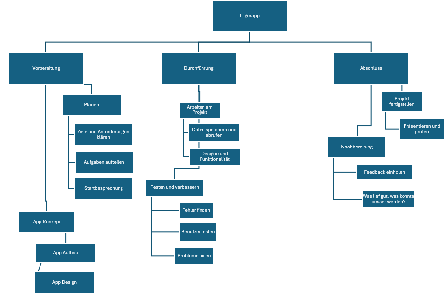
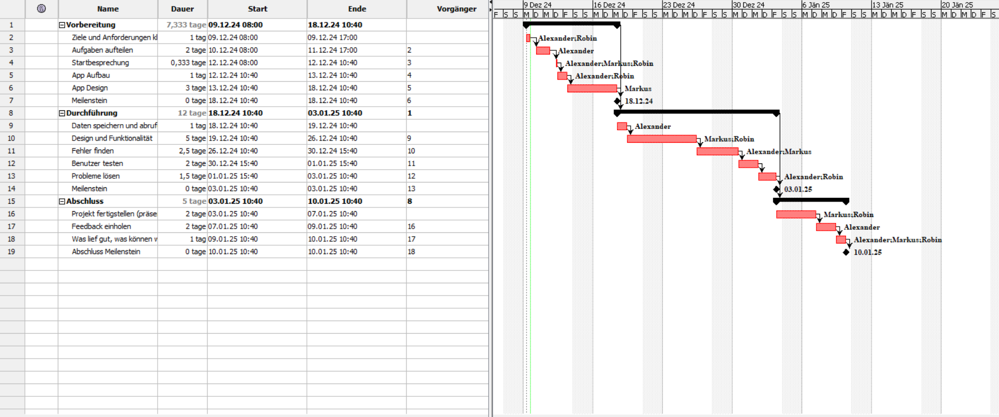

## Projektbeschreibung:
Das Projekt besteht in der Entwicklung einer einfachen Lagerverwaltungs-App, die es ermöglicht, Lagerorte und Bestände von Produkten anzuzeigen. Die App soll Benutzer
erlauben, Produkte zu suchen, Lagerorte zu identifizieren und Bestände in Echtzeit einzusehen. Mit der App können Unternehmen ihre Lager effizient verwalten, indem sie die Zugänglichkeit von Lagerdaten verbessert und die Nachverfolgbarkeit von Produkten erleichtert.

### Zielsetzung (SMART-Ziele):
Innerhalb von 3 Monaten soll eine 
funktionsfähige Lagerverwaltungs-App 
entwickelt werden, die es den Nutzern 
ermöglicht, Lagerorte und Bestände von 
mindestens 300 Produkten in Echtzeit zu 
erfassen und anzuzeigen. Die App wird sowohl 
für mobile Geräte als auch für den Desktop 
nutzbar sein und eine intuitive Suchfunktion 
bieten, um Produkte schnell zu finden. 
Die Genauigkeit der Bestandsdaten soll 
bei mindestens 90 % liegen.

### Projektorganisation und Aufteilung
Wir machen eine Matrix Organisation, wobei die Routinearbeit die Schule ist und das Projekt nebenbei gemacht wird.

- Auftraggeber: Herr Professor Landerer und Netzer
- Projektleiter: Alexander Klapeer
- Projektmitarbeiter: Robin Melmer und Markus Grün
- Kunde: Unternehmer

## Teamaufgabe II

### Screenshot PSP

### Screenshot GANTT

